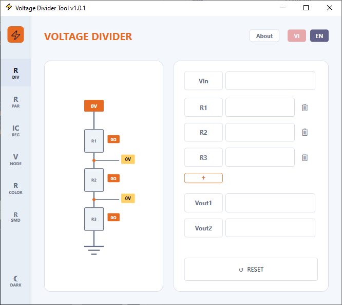

# Voltage Divider Tool

English | [Tiếng Việt](#tiếng-việt)

A lightweight electronics calculator for Windows, focused on common resistor-related tasks such as voltage dividers and more.

## Features

### Voltage divider

- Calculates node voltages for a customizable number of resistors.
- Supports reverse calculation of `Vin` from `Vout`.
- Can calculate a missing resistor when the related node voltages are available.
- Redraws the circuit diagram automatically when values change.

### Parallel resistance

- Calculates total resistance for multiple parallel resistors.
- Allows adding or removing resistors directly from the UI.
- Supports reverse calculation of one resistor from the total resistance and the remaining resistors.

### Adjustable regulator

- Suitable for adjustable regulator circuits such as `LM1117 ADJ`.
- Quickly calculates `Vref`, `R1`, `R2`, and `Vout`.
- Uses `1.25V` as the default `Vref`, with manual override support.

### Voltage node

- Calculates a node connected to two sources, two input resistors, and one resistor to ground.
- Supports calculating `Vnode` or solving backward for `V1`, `V2`, `R1`, `R2`, or `R3` when enough data is available.

### Resistor color code

- Supports 4-band, 5-band, and 6-band resistors.
- Displays resistance, tolerance, and temperature coefficient when the 6th band is used.
- Draws a resistor preview on the canvas using the selected colors.

### SMD resistor code

- Decodes 3-digit and 4-digit SMD resistor codes.
- Supports `R` as the decimal separator, for example `4R7` = `4.7Ω`.
- Automatically formats results as `Ω`, `kΩ`, or `MΩ`.

## Usage

1. Select a tool from the left sidebar.
2. Enter voltage or resistance values in the corresponding fields.
3. Click the label button for the value you want to calculate, such as `Vin`, `Vout1`, `R1`, or `Rtotal`.
4. Use the `+` button to add resistors in supported modes.
5. Use the `VI/EN` language buttons and theme toggle to switch language or light/dark mode.

## Download and run

1. Go to the [Releases](https://github.com/mhqb365/VoltageDividerTool/releases) page.
2. Download the latest `.zip` file.
3. Extract it to any folder.
4. Run `Voltage Divider Tool.exe`.

The app requires .NET Framework 4.8 or later. Windows 10/11 usually includes it already, or it can be installed through Windows Update.

## License

MIT license

---

## Tiếng Việt

Phần mềm tính toán điện tử nhỏ gọn cho Windows, tập trung vào các bài toán điện trở thường gặp như cầu phân áp, v.v..

## Tính năng

### Cầu phân áp

- Tính điện áp tại từng nút với số lượng điện trở tùy biến.
- Hỗ trợ tính ngược `Vin` từ `Vout`.
- Có thể tính ngược một điện trở khi đã có đủ các điện áp nút liên quan.
- Sơ đồ mạch được vẽ lại tự động khi thay đổi giá trị.

### Điện trở song song

- Tính tổng trở của nhiều điện trở mắc song song.
- Thêm hoặc bớt điện trở trực tiếp trên giao diện.
- Hỗ trợ tính ngược một điện trở khi đã biết tổng trở và các điện trở còn lại.

### IC ổn áp

- Phù hợp với các mạch ổn áp điều chỉnh như `LM1117 ADJ`.
- Tính nhanh `Vref`, `R1`, `R2` và `Vout`.
- Giá trị `Vref` mặc định là `1.25V` nhưng có thể thay đổi.

### Điện áp nút

- Tính mạch gồm hai nguồn `V1`, `V2`, hai điện trở nối về nút và một điện trở xuống mass.
- Hỗ trợ tính `Vnode` hoặc tính ngược `V1`, `V2`, `R1`, `R2`, `R3` khi đủ dữ liệu.

### Mã màu điện trở

- Hỗ trợ điện trở 4 vòng, 5 vòng và 6 vòng màu.
- Hiển thị giá trị điện trở, sai số và hệ số nhiệt khi có vòng thứ 6.
- Vẽ mô phỏng điện trở trên canvas theo các màu đã chọn.

### Mã điện trở dán SMD

- Giải mã SMD 3 chữ số và 4 chữ số.
- Hỗ trợ ký tự `R` làm dấu thập phân, ví dụ `4R7` = `4.7Ω`.
- Tự động định dạng kết quả theo `Ω`, `kΩ`, `MΩ`.

## Cách sử dụng

1. Chọn công cụ ở sidebar bên trái.
2. Nhập giá trị điện áp hoặc điện trở vào các ô tương ứng.
3. Bấm vào nút tên đại lượng cần tính, ví dụ `Vin`, `Vout1`, `R1`, `Rtotal`.
4. Dùng nút `+` để thêm điện trở trong các chế độ hỗ trợ.
5. Dùng nút đổi ngôn ngữ `VI/EN` và nút theme để chuyển giao diện sáng/tối.

## Tải về và chạy ứng dụng

1. Vào trang [Releases](https://github.com/mhqb365/VoltageDividerTool/releases).
2. Tải file `.zip` mới nhất.
3. Giải nén vào một thư mục bất kỳ.
4. Chạy `Voltage Divider Tool.exe`.

Máy tính cần có .NET Framework 4.8 trở lên. Windows 10/11 thường đã có sẵn hoặc có thể cài qua Windows Update.

## Giấy phép

MIT license
